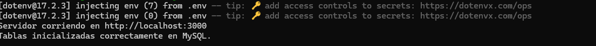

# Guía completa para preparar entorno Node.js en Windows 11

<!-- TOC -->
* [Guía completa para preparar entorno Node.js en Windows 11](#guía-completa-para-preparar-entorno-nodejs-en-windows-11)
  * [1. Instalar Node.js (incluye npm)](#1-instalar-nodejs-incluye-npm)
  * [2. Instalar Visual Studio Code (IDE recomendado)](#2-instalar-visual-studio-code-ide-recomendado)
  * [3. Instalar Git (control de versiones)](#3-instalar-git-control-de-versiones)
  * [4. Autenticación](#4-autenticación)
  * [5. Crear el proyecto BACKEND](#5-crear-el-proyecto-backend)
    * [Crear archivo básico `src/server.js`](#crear-archivo-básico-srcserverjs)
    * [Crear database/db.js (Configuración de la Base de Datos)](#crear-databasedbjs-configuración-de-la-base-de-datos)
    * [Crear archivo `.env`](#crear-archivo-env)
    * [Crear archivo `.gitignore`](#crear-archivo-gitignore)
    * [Crear las clases del modelo](#crear-las-clases-del-modelo)
    * [Crear los controladores](#crear-los-controladores)
    * [Crear rutas](#crear-rutas)
    * [Middleware para verificar tokens JWT en rutas protegidas](#middleware-para-verificar-tokens-jwt-en-rutas-protegidas)
  * [6. Ejecutar](#6-ejecutar)
  * [7. Probar](#7-probar)
<!-- TOC -->

## 1. Instalar Node.js (incluye npm)

**¿Qué es?**

- **Node.js**: Entorno de ejecución para JavaScript
- **npm**: Gestor de paquetes (como Maven para Java)

**Instalación:**

1. Ve a <https://nodejs.org/>
2. Descarga la versión **LTS** (Long Term Support) - recomendada
3. Ejecuta el instalador (.msi)
4. En el instalador:
   - ✅ Acepta la licencia
   - ✅ Deja la ruta por defecto: `C:\Program Files\nodejs\`
   - ✅ Marca "Automatically install the necessary tools" (opcional pero útil)
   - ✅ Instala

5. **Verifica la instalación:**

   ```bash
   # Abre PowerShell o CMD
   node --version
   npm --version
   ```

   Deberías ver algo como: `v20.x.x` y `10.x.x`

**Variables de entorno (se configuran automáticamente):**

- `C:\Program Files\nodejs\` se añade al PATH
- `C:\Users\TuUsuario\AppData\Roaming\npm` se añade al PATH (para paquetes globales)

## 2. Instalar Visual Studio Code (IDE recomendado)

**¿Qué es?** Editor de código ligero y potente para desarrollo web.

**Instalación:**

1. Ve a <https://code.visualstudio.com/>
2. Descarga e instala
3. Durante instalación marca:
   - ✅ "Add to PATH"
   - ✅ "Create a desktop icon"
   - ✅ "Add 'Open with Code' to context menu"

**Extensiones esenciales para VS Code:**

Abre VS Code → Extensions (Ctrl+Shift+X) → Busca e instala:

1. **Prettier - Code formatter** - Formatear código automáticamente
2. **ESLint** - Detectar errores en JavaScript
3. **REST Client** o **Thunder Client** - Probar APIs sin Postman
4. **npm Intellisense** - Autocompletar imports de npm

## 3. Instalar Git (control de versiones)

**Instalación:**

1. Ve a <https://git-scm.com/>
2. Descarga e instala
3. Deja opciones por defecto (importante: "Git from command line and also from 3rd-party software")
4. Verifica:

   ```bash
   git --version
   ```
   
## 4. Autenticación

Usaremos JWT (JSON Web Tokens) para manejar sesiones. Los usuarios se registrarán y harán login. Las rutas de Recetas estarán protegidas por un middleware que verifica el token.

## 5. Crear el proyecto BACKEND

**Paso a paso:**

```bash
# Abre PowerShell o CMD
cd C:\proyectos
mkdir mi-aplicacion
cd mi-aplicacion
mkdir backend
cd backend

# Inicializar proyecto Node.js
npm init -y
```

Esto crea `package.json` (equivalente a `pom.xml`)

**Instalar Express (framework web para Node.js):**

```bash
npm install express mysql2 body-parser cors jsonwebtoken bcryptjs dotenv
```

Explicación de cada dependencia:

Aquí detallo qué hace cada paquete y por qué es necesario para nuestro backend:

- **express**: Framework web para Node.js. Se usa para crear el servidor, definir rutas y manejar solicitudes HTTP (e.g., GET, POST). Es el núcleo del backend.
- **mysql2**: Librería para conectar y interactuar con MySQL (tu base de datos). Necesario para operaciones CRUD en las tablas de usuarios y recetas.
- **body-parser**: Middleware para parsear el cuerpo de las solicitudes HTTP (e.g., JSON en POST). Aunque Express 4.16+ lo incluye integrado, lo instalamos por compatibilidad y claridad.
- **cors**: Middleware para habilitar Cross-Origin Resource Sharing. Permite que tu frontend (e.g., en otro puerto) haga solicitudes al backend sin errores de origen cruzado.
- **jsonwebtoken**: Librería para generar y verificar tokens JWT. Esencial para la autenticación: crea tokens en login y los valida en rutas protegidas.
- **bcryptjs**: Librería para hashear contraseñas. Protege las passwords de usuarios al almacenarlas en la DB (no en texto plano).
- **dotenv**: Librería para cargar variables de entorno desde un archivo .env. Útil para almacenar secretos como JWT_SECRET de forma segura (no en el código).

Notas Adicionales:

- Después de instalar, crea un archivo .env en la raíz del proyecto con JWT_SECRET=tu_clave_secreta_aqui (cambia "tu_clave_secreta_aqui" por algo único y seguro).
- Para ejecutar el servidor: node server.js (o usa nodemon para recargas automáticas: instala con npm install -g nodemon y ejecuta nodemon server.js).

**Estructura básica del backend:**

Siguiendo el patrón de separación de responsabilidades (SOLID: Single Responsibility Principle), donde cada módulo 
tiene una única razón para cambiar.

```
backend\
  ├─ node_modules\        (dependencias - NO subir a Git)
  ├─ src\
  │   ├─ controllers\       (Lógica de negocio y manejo de solicitudes)
  │   ├─ models\            (Contiene las clases de datos (e.g., Receta))
  │   ├─ routes\            (Definición de endpoints)
  │   ├─ database\          (Configuración de la base de datos)
  │   └─ server.js        (punto de entrada)
  ├─ .env                 (variables de entorno)
  ├─ .gitignore
  └─ package.json
```

### Crear archivo básico `src/server.js`

Este archivo configura e inicia el servidor Express. Sigue el principio de Dependency Inversion al depender de 
abstracciones (routes) en lugar de implementaciones concretas.

```javascript
// server.js
// Punto de entrada de la aplicación. Configura el servidor Express, conecta rutas y middleware.
// Principio SOLID: Single Responsibility - Solo configura el servidor.
// Principio SOLID: Dependency Inversion - Depende de rutas y middleware abstractos.

require('dotenv').config(); // Cargar variables de entorno
const express = require('express');
const bodyParser = require('body-parser');
const cors = require('cors');
const recetaRoutes = require('./routes/recetas'); // Rutas de recetas (protegidas)
const authRoutes = require('./routes/auth'); // Nuevas rutas de autenticación
const authMiddleware = require('./middleware/auth'); // Middleware para verificar tokens

const app = express();
const PORT = process.env.PORT || 3000;

// Middleware para parsear JSON y habilitar CORS
app.use(bodyParser.json());
app.use(cors());

// Rutas públicas (no requieren token)
app.use('/api/auth', authRoutes); // Registro y login

// Rutas protegidas (requieren token)
app.use('/api/recetas', authMiddleware, recetaRoutes); // Aplicamos middleware de auth a todas las rutas de recetas

// Iniciar el servidor
app.listen(PORT, () => {
    console.log(`Servidor corriendo en http://localhost:${PORT}`);
});
```

### Crear database/db.js (Configuración de la Base de Datos)

Aquí configuramos MySQL. Usamos una tabla simple para Usuarios y una para Recetas. Esto encapsula la lógica de DB.
(Single Responsibility).

```javascript
// database/db.js
// Módulo para manejar la conexión y operaciones básicas de MySQL.
// Principio SOLID: Single Responsibility - Solo gestiona la DB.

require('dotenv').config(); // Cargar variables de entorno
const mysql = require('mysql2/promise'); // Usamos mysql2 para promesas (compatible con MySQL)

// Configuración de conexión a MySQL usando variables de entorno
const dbConfig = {
    host: process.env.DB_HOST,
    user: process.env.DB_USER,
    password: process.env.DB_PASSWORD,
    database: process.env.DB_NAME,
    waitForConnections: true,
    connectionLimit: parseInt(process.env.DB_CONNECTION_LIMIT) || 10,
    queueLimit: 0,
};

// Crear pool de conexiones
const pool = mysql.createPool(dbConfig);

// Inicializar tablas si no existen
const initDB = async () => {
    try {
        await pool.execute(`
      CREATE TABLE IF NOT EXISTS usuarios (
        id INT AUTO_INCREMENT PRIMARY KEY,
        username VARCHAR(255) UNIQUE NOT NULL,
        password VARCHAR(255) NOT NULL
      )
    `);
        await pool.execute(`
      CREATE TABLE IF NOT EXISTS recetas (
        id INT AUTO_INCREMENT PRIMARY KEY,
        nombre VARCHAR(255) NOT NULL,
        ingredientes JSON NOT NULL,  // MySQL soporta JSON desde 5.7.8
        instrucciones TEXT NOT NULL,
        usuario_id INT NOT NULL,  // Relación con usuario (para que cada receta pertenezca a un usuario)
        FOREIGN KEY (usuario_id) REFERENCES usuarios(id) ON DELETE CASCADE
      )
    `);
        console.log('Tablas inicializadas correctamente en MySQL.');
    } catch (error) {
        console.error('Error inicializando DB:', error);
    }
};

initDB(); // Ejecutar al cargar el módulo

module.exports = pool; // Exportamos el pool para reutilizarlo
```

### Crear archivo `.env`

```
PORT=3000
DB_HOST=localhost
DB_USER=root
DB_PASSWORD=
DB_NAME=recetas_db
DB_CONNECTION_LIMIT=10
```

### Crear archivo `.gitignore`

```
node_modules/
.env
*.log
```

### Crear las clases del modelo

- `models/Receta.js`: La clase Receta representa la entidad de datos. Sigue Clean Code con nombres descriptivos y métodos simples. No maneja lógica de DB aquí (Single Responsibility).
- `models/Usuario.js`: La clase Usuario representa a los usuarios del sistema con campos: id, username, password (hasheada con bcrypt).

### Crear los controladores

- `controllers/authController.js`: Aquí va la lógica de negocio para registro y login. Maneja hashing de contraseñas y generación de tokens JWT. Sigue Single Responsibility.
- `controllers/recetaController.js`: Aquí va la lógica de negocio para CRUD. Interactúa con el modelo y la DB. Sigue Open/Closed Principle (fácil de extender) y Single Responsibility.

### Crear rutas

- `routes/auth.js`: Define endpoints para registro y login. Sigue Single Responsibility al manejar solo autenticación.
- `routes/recetas.js`: Define los endpoints. Sigue Interface Segregation Principle al exponer solo lo necesario.

### Middleware para verificar tokens JWT en rutas protegidas

- `middleware/auth.js`: Verifica el token JWT en las solicitudes. Si es válido, permite el acceso; si no, responde con 401 Unauthorized.

## 6. Ejecutar

**DB:**

Crea la DB recetas_db en MySQL (usa CREATE DATABASE recetas_db; en MySQL CLI).

**Arrancar el servidor:**

1. Sin nodemon (solo para pruebas rápidas, no recomendado para desarrollo continuo):

El servidor se inicia, pero debes reiniciarlo manualmente con Ctrl+C y volver a ejecutar cada vez que cambies el código.

Ejecuta `node server.js.`

2. Con nodemon (recomendado para desarrollo):

Instala nodemon solo en el proyecto (si no lo tienes):

`npm install --save-dev nodemon`

Configurar scripts en package.json (opcional pero recomendado)
Abre tu package.json y agrega o modifica la sección "scripts" para incluir un comando de desarrollo. Esto facilita 
el arranque, permitiendo ejecutar npm run dev en lugar de comandos largos.

```
{
  "scripts": {
    "start": "node server.js", // Para producción
    "dev": "nodemon server.js" // Para desarrollo (reinicio automático)
  }
}
```

Cuidado con el Copy&Paste que los comentarios no están permitidos en JSON.

Arrancar la Aplicación:

```bash
npm run dev    # Modo desarrollo (se reinicia solo con cambios)
# o
npm start      # Modo producción
```

Es equivalente a nodemon server.js, pero más limpio.

Esperamos algo así como respuesta: 

## 7. Probar

En server.js añadir dantes de los app.use:

```javascript
// TESTING GET Para test básico del servidor (health check)
app.get('/', (req, res) => res.send('Servidor funcionando'));
```

URL de prueba en el navegador:
http://localhost:3000/

Debe devolver: 'Servidor funcionando'

URL de prueba en el navegador:
http://localhost:3000/api/recetas

Debe devolver: {"error":"Acceso denegado. Token requerido."}

Y ya con Postman empezar crear proyecto para prueba de endpoints: 

Registro: POST http://localhost:3000/api/auth/register con {"username": "test", "password": "123"}.
Login: POST http://localhost:3000/api/auth/login con las mismas credenciales (obtén el token).
Usa el token en headers (Authorization: Bearer <token>) para rutas de /api/recetas.
